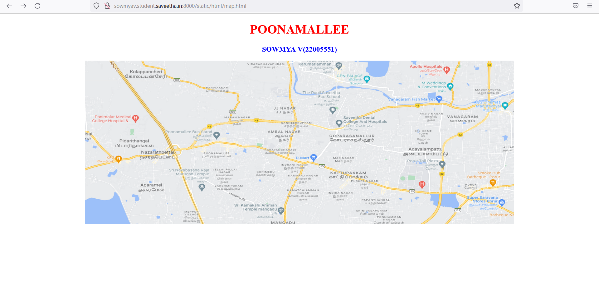
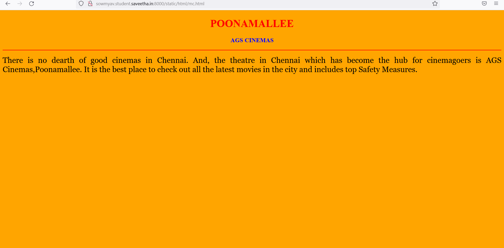
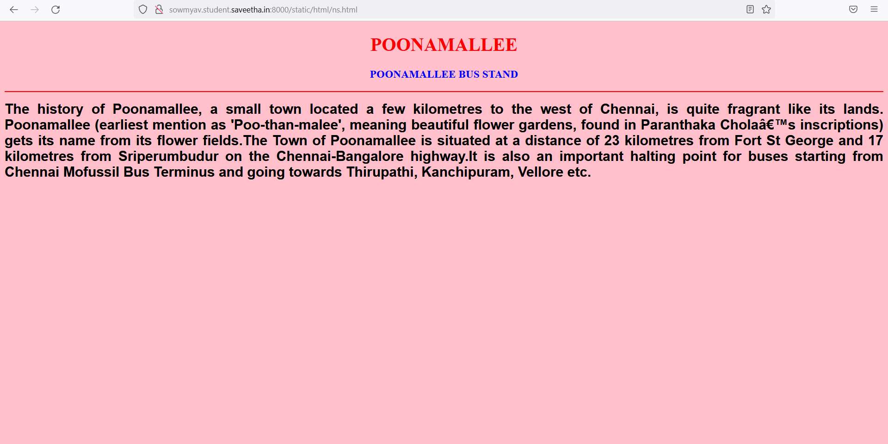
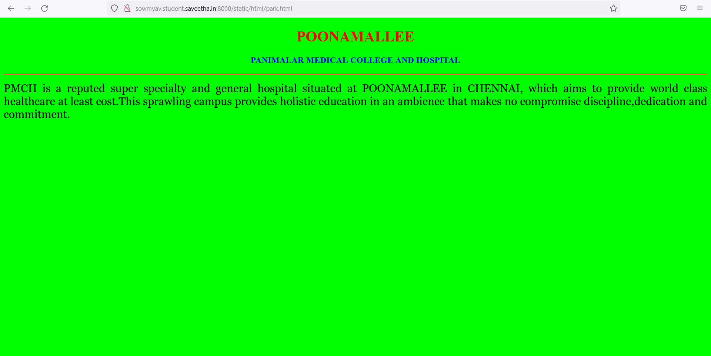
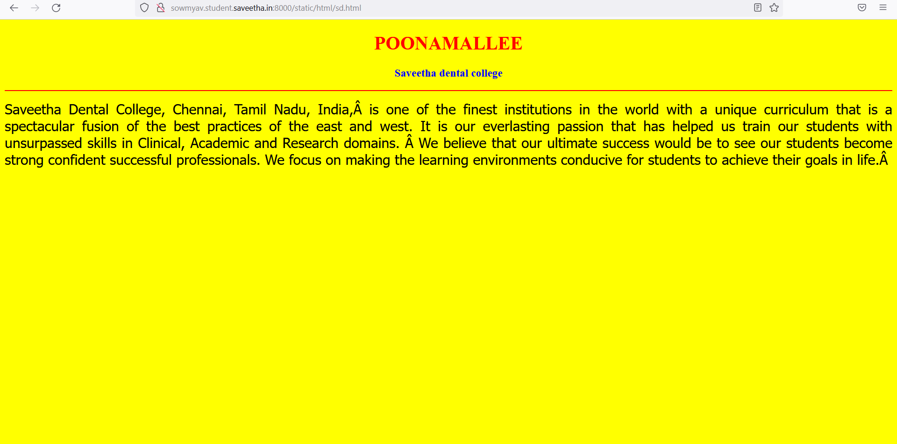
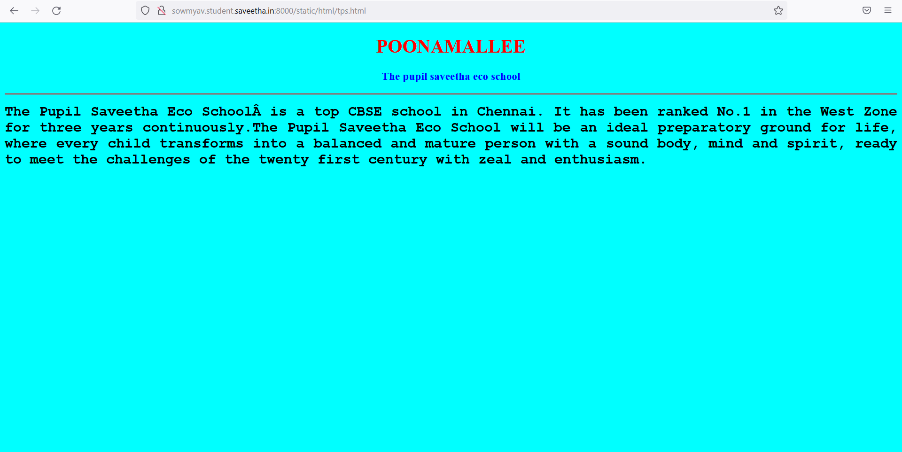
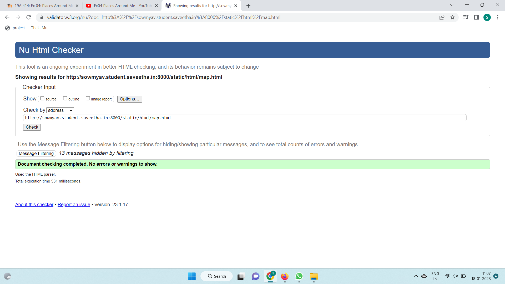

# Places Around Me

## AIM:
To develop a website to display details about the places around my house.

## Design Steps:

### Step 1:
Clone the github repository into Theia IDE.

### Step 2:
Create a new Django project.

### Step 3:
Write the needed HTML code.

### Step 4:
Run the Django server and execute the HTML files.

## Code:
```
map.html

<!DOCTYPE html>
<html lang="en">
<head>
<title>My City</title>
</head>
<body>
<h1 align="center">
<font color="red"><b>POONAMALLEE</b></font>
</h1>
<h3 align="center">
<font color="blue"><b>SOWMYA V(22005551)</b></font>
</h3>
<center>

<map name="MyCity">
<area shape="circle" coords="700,600,100" href="/static/html/tps.html" title="THE PUPIL SAVEETHA ECO SCHOOL">
<area shape="rectangle" coords="230,30,260,60" href="/static/html/sd.html" title="SAVEETHA DENTAL COLLEGE">
<area shape="circle" coords="400,200,75" href="/static/html/ns.html" title="POONAMALLEE BUS STAND">
<area shape="circle" coords="400,350,50" href="/static/html/mc.html" title="AGS CINEMAS">
<area shape="circle" coords="190,50,20" href="/static/html/park.html" title="PANIMALAR MEDICAL COLLEGE AND HOSPITALS">
</map>
</center>
</body>
</html>

mc.html

<!DOCTYPE html>
<html lang="en">
<head>
<title>AGS CINEMAS</title>
</head>
<body bgcolor="orange">
<h1 align="center">
<font color="red"><b>POONAMALLEE</b></font>
</h1>
<h3 align="center">
<font color="blue"><b>AGS CINEMAS</b></font>
</h3>
<hr size="3" color="red">
<p align="justify">
<font face="Georgia" size="5">
There is no dearth of good cinemas in Chennai. And, the theatre in Chennai which has become the hub for cinemagoers is AGS Cinemas,Poonamallee. It is the best place to check out all the latest movies in the city and includes top Safety Measures.
</font>
</p>
</body>
</html>

ns.html

<!DOCTYPE html>
<html lang="en">
<head>
<title>POONAMALLEE BUS STAND</title>
</head>
<body bgcolor="pink">
<h1 align="center">
<font color="red"><b>POONAMALLEE</b></font>
</h1>
<h3 align="center">
<font color="blue"><b>POONAMALLEE BUS STAND</b></font>
</h3>
<hr size="3" color="red">
<p align="justify">
<font face="Arial" size="5">
<b>
The history of Poonamallee, a small town located a few kilometres to the west of Chennai, is quite fragrant like its lands. Poonamallee (earliest mention as 'Poo-than-malee', meaning beautiful flower gardens, found in Paranthaka Chola’s inscriptions) gets its name from its flower fields.The Town of Poonamallee is situated at a distance of 23 kilometres from Fort St George and 17 kilometres from Sriperumbudur on the Chennai-Bangalore highway.It is also an important halting point for buses starting from Chennai Mofussil Bus Terminus and going towards Thirupathi, Kanchipuram, Vellore etc.
</b>
</font>
</p>
</body>
</html>

park.html

<!DOCTYPE html>
<html lang="en">
<head>
<title>PANIMALAR MEDICAL COLLEGE AND HOSPITAL</title>
</head>
<body bgcolor="lime">
<h1 align="center">
<font color="red"><b>POONAMALLEE</b></font>
</h1>
<h3 align="center">
<font color="blue"><b>PANIMALAR MEDICAL COLLEGE AND HOSPITAL</b></font>
</h3>
<hr size="3" color="red">
<p align="justify">
<font face="Georgia" size="5">
PMCH is a reputed super specialty and general hospital situated at POONAMALLEE in CHENNAI, which aims to provide world class healthcare at least cost.This sprawling campus provides holistic education in an ambience that makes no compromise discipline,dedication and commitment.
</font>
</p>
</body>
</html>

sd.html

<!DOCTYPE html>
<html lang="en">
<head>
<title>SAVEETHA DENTAL COLLEGE</title>
</head>
<body bgcolor="yellow">
<h1 align="center">
<font color="red"><b>POONAMALLEE</b></font>
</h1>
<h3 align="center">
<font color="blue"><b>Saveetha dental college</b></font>
</h3>
<hr size="3" color="red">
<p align="justify">
<font face="Tahoma" size="5">
Saveetha Dental College, Chennai, Tamil Nadu, India, is one of the finest institutions in the world with a unique curriculum that is a spectacular fusion of the best practices of the east and west. It is our everlasting passion that has helped us train our students with unsurpassed skills in Clinical, Academic and Research domains.  We believe that our ultimate success would be to see our students become strong confident successful professionals. We focus on making the learning environments conducive for students to achieve their goals in life. 
</font>
</p>
</body>
</html>

tps.html

<!DOCTYPE html>
<html lang="en">
<head>
<title>THE PUPIL SAVEETHA ECO SCHOOL</title>
</head>
<body bgcolor="cyan">
<h1 align="center">
<font color="red"><b>POONAMALLEE</b></font>
</h1>
<h3 align="center">
<font color="blue"><b>The pupil saveetha eco school</b></font>
</h3>
<hr size="3" color="red">
<p align="justify">
<font face="Courier New" size="5">
<b>
The Pupil Saveetha Eco School is a top CBSE school in Chennai. It has been ranked No.1 in the West Zone for three years continuously.The Pupil Saveetha Eco School will be an ideal preparatory ground for life, where every child transforms into a balanced and mature person with a sound body, mind and spirit, ready to meet the challenges of the twenty first century with zeal and enthusiasm.
</b>
</font>
</p>
</body>
</html>
```

## Output:













## HTML Validator:



## Result:
The program for implementing image map is executed successfully.